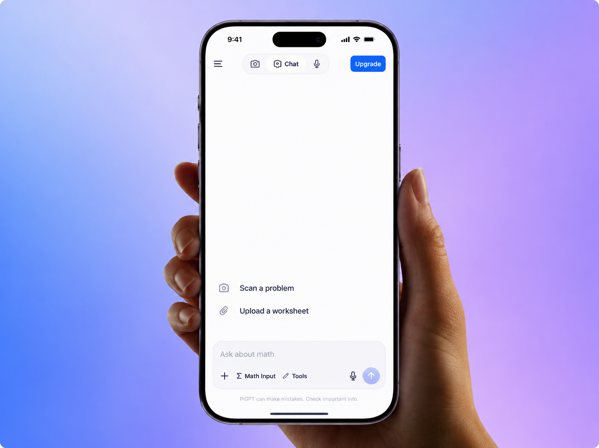

# PiGPT

<p align="center">
  
</p>

<p align="center">
  <strong>A consumer AI study app for Math, Physics, Chemistry and Accounting.</strong><br/>
  Type a question, photograph a problem, upload a worksheet, dictate aloud, or record an entire lecture.<br/>
  Get a streamed, step-by-step explanation back, plus quizzes, notes and progress tracking.
</p>

<p align="center">
  React Native (Expo) · Node.js (Express) · TypeScript end to end · Generative AI for text, vision and audio
</p>

---

## Why this repo is worth a look

This is a full product, not a demo or an AI wrapper.
One person designed it, built both apps, wired the AI layer, wrote the migrations and shipped it to a device.

It is deliberately relevant to a full-stack product engineering role:

- **Mobile front end.** Expo SDK 54, React Native 0.81, expo-router, Zustand, 42 hand-authored SVG icons, a custom 2D maths typesetter, seven coordinated overlays with their own mount/animation ordering.
- **Node back end.** Express 5, Prisma 7 on Neon Postgres, Zod validation on every request body and on the environment at boot, custom rate limiting, a typed error surface.
- **Generative AI across modalities.** Text, image and audio through one provider-neutral message shape, with per-request routing between OpenRouter and Google Gemini.
- **Real streaming.** NDJSON over `expo/fetch` because React Native's global `fetch` cannot read a body incrementally, with a paced reveal that smooths the network's lumpy bursts into an even typewriter cadence.
- **Shipped.** Render blueprint for the API, EAS build profiles for the app, real SQL migrations applied on every deploy.

The engineering decisions and their reasons are written down in [FEATURES.md](FEATURES.md), which documents every screen, endpoint, table and known gap.

---

## Table of contents

- [Product tour](#product-tour)
- [Tech stack](#tech-stack)
- [Architecture](#architecture)
- [Repository layout](#repository-layout)
- [API surface](#api-surface)
- [Data model](#data-model)
- [The AI layer](#the-ai-layer)
- [Engineering decisions worth explaining](#engineering-decisions-worth-explaining)
- [Running it locally](#running-it-locally)
- [Configuration](#configuration)
- [Deployment](#deployment)
- [Known gaps](#known-gaps)

---

## Product tour

### Solver

The home screen is a chat.
Answers stream in token by token and are typeset in two dimensions: a fraction is a real numerator over a rule over a denominator, not `a/b`.

- Threads are first-class. A chat is one row in Recents no matter how many follow-ups it contains, and relaunching the app continues the same thread.
- Four independent per-subject threads, cached locally, capped at the last 50 messages, with the last 10 turns sent as context.
- The stop button aborts the in-flight request. A user-initiated stop keeps whatever arrived and is not treated as an error.
- The `Problem` row is created before any text is generated and finished in a `finally` block, so an abandoned or failed stream still leaves the turn in history.
- Network failures are rewritten into human language before they reach the screen, with a **Try again** chip that re-runs the turn in place.
- Follow-up chips build an answerable practice set on whatever sub-topic the conversation settled on, rather than posting another wall of text to read.

### Camera and photo solving

Live viewfinder, permission handled on mount, gallery fallback, subject chips drawn from onboarding.
Taking a photo returns to the solver and submits it with a subject-specific prompt.
Images travel as base64 and are converted to whatever the chosen provider expects.

### Voice

Two capabilities that deliberately do not share a screen.

- **Dictation** from the composer microphone. Audio in, plain text appended to the composer, with spoken maths written back in normal notation (`x squared` becomes `x^2`).
- **Lecture recording** with a hundredths-precision timer and a live waveform built from dBFS input metering, then a structured summary: title, overview, key points, topics, and follow-up questions the student should be able to answer. Every summary is saved to Notes automatically.

### Quizzes

The quiz is a window over the conversation, never a separate tab, so the chat behind it is never lost.
The model returns strict JSON, LaTeX inside that JSON is repaired before parsing, and the result is validated with Zod.
Unusable model output answers 502 with something the student can act on and a busy free model answers 503, so neither shows up as a 500.
**Show Steps** expands the worked solution as collapsible rows, one open at a time, because a wall of working is not what a stuck student reads.

### Progress

Problems solved this week, overall accuracy, day streak, a seven-day calendar, per-subject accuracy bars, and a **Needs work** list of sub-60% topics with a one-tap "Quiz me on these".

### Notes, search, sidebar

Notes holds lecture summaries and saved solutions.
Search covers solved problems and past quizzes and reopens either in place.
The sidebar carries navigation, pinned quizzes and Recents.
Each library surface shows exactly one kind of thing.

---

## Tech stack

### Mobile (`mobile/`)

| Area | Choice |
| --- | --- |
| Framework | Expo SDK 54, React Native 0.81.5, React 19.1 |
| Language | TypeScript 5.9, path alias `@/*` |
| Navigation | expo-router 6, file-based, React Compiler on |
| State | Zustand 5, seven stores |
| Auth | Clerk (`@clerk/clerk-expo`) with `expo-secure-store` token cache |
| Networking | axios for REST, `expo/fetch` for incremental stream reading |
| Local storage | AsyncStorage, namespaced per account |
| Graphics | react-native-svg, expo-linear-gradient, expo-glass-effect |
| Animation | Animated API, Reanimated 4 |
| Media | expo-camera, expo-image-picker, expo-document-picker, expo-audio, expo-file-system |
| Build | EAS Build, `development` / `preview` (Android APK) / `production` profiles |

### Backend (`backend/`)

| Area | Choice |
| --- | --- |
| Runtime | Node.js, ESM, `tsx watch` in dev, compiled `tsc` output in production |
| Framework | Express 5 |
| Language | TypeScript |
| ORM | Prisma 7 with the Neon driver adapter |
| Database | Neon serverless PostgreSQL |
| Auth | `@clerk/express` plus a custom `authMiddleware` |
| Validation | Zod, on every request body and on the environment at boot |
| Uploads | multer, memory storage, PDF only, 10 MB cap |
| AI: text and vision | OpenRouter, OpenAI-compatible HTTP API |
| AI: audio | Google Gemini via `@google/genai` |
| Reliability | Custom fixed-window rate limiter, typed error handler, timestamped logger |

### Infrastructure

Render for the API (free plan, health check at `/health`), Neon for Postgres, EAS for app distribution.
`prisma migrate deploy` runs as part of `npm start`, so every deploy applies pending schema changes.
No secret is committed. `.env.example` documents the shape in both packages.

**On the target stack:** this project uses Clerk and Neon Postgres where the role uses Firebase and Firestore, and OpenRouter alongside Gemini where the role uses OpenAI.
Those are adapter-level differences.
The parts that transfer are the ones that matter: the provider-neutral AI boundary, streaming into a React Native UI, typed API contracts, migrations, and debugging across mobile, backend and third-party services.
Next.js, Stripe and Mixpanel are not in this repo.

---

## Architecture

```
┌──────────────────────────────┐
│  Expo app (iOS / Android)    │
│  expo-router · Zustand       │
│  axios  +  expo/fetch stream │
└───────────────┬──────────────┘
                │  Bearer <Clerk JWT>
                ▼
┌──────────────────────────────┐
│  Express 5 API               │
│  clerkMiddleware → auth      │
│  Zod validation · rate limit │
│  8 routers / 8 controllers   │
└───────┬───────────────┬──────┘
        │               │
        ▼               ▼
┌───────────────┐  ┌──────────────────────┐
│ Prisma 7      │  │ AI provider layer    │
│ Neon Postgres │  │ text+vision → OpenRouter │
│ 7 models      │  │ audio        → Gemini    │
└───────────────┘  └──────────────────────┘
```

Every route under `/api` requires a valid Clerk session.
`ensureUser(clerkId)` upserts the `User` row so every foreign key has a target, cached per process so the Clerk lookup happens at most once per user.
`/health` is the only public endpoint.

---

## Repository layout

```
math-buddy/
├─ package.json          # convenience scripts, not an npm workspace
├─ render.yaml           # Render blueprint for the API
├─ FEATURES.md           # full feature and stack reference
├─ DEPLOY.md             # free-tier deployment guide
├─ backend/
│  ├─ prisma/            # schema + real SQL migrations
│  ├─ scripts/seed.ts    # idempotent demo-data seeder
│  ├─ e2e.ts             # end-to-end AI smoke test
│  └─ src/
│     ├─ index.ts        # Express bootstrap
│     ├─ config/env.ts   # Zod-validated env, exits on failure
│     ├─ routes/ controllers/ middleware/
│     ├─ services/ai/    # provider, openrouter, gemini, buildPrompt, parseResponse
│     ├─ services/storage/
│     └─ types/ utils/
└─ mobile/
   └─ src/
      ├─ app/            # (auth) · onboarding · (tabs): solver, camera, voice, progress
      ├─ components/     # ui · shared · solver · quiz · voice
      ├─ store/ hooks/ services/api/
      ├─ constants/      # design tokens taken from the design canvas
      └─ types/ utils/
```

---

## API surface

| Method | Path | Purpose |
| --- | --- | --- |
| `GET` | `/health` | Liveness probe |
| `GET` | `/api/auth/me` | The authenticated user id |
| `POST` | `/api/solve` | One-shot solve: parsed steps, final answer, tip, topic, raw text |
| `POST` | `/api/solve/stream` | NDJSON token stream |
| `POST` | `/api/quiz` | Generate a quiz |
| `POST` | `/api/quiz/submit` | Persist an attempt, recompute subject accuracy |
| `GET` | `/api/quiz/history` | 20 most recent attempts |
| `GET` | `/api/progress` | Aggregate stats and per-subject breakdown |
| `GET` | `/api/progress/recent?page=N` | Paginated problem history |
| `GET` | `/api/progress/problem/:id` | One problem with its full answer |
| `GET` | `/api/progress/weak-topics` | Sub-60% topics from the last seven days |
| `GET` | `/api/progress/streak` | Seven-day activity calendar |
| `GET` | `/api/conversations?page=N` | Chat threads, most recently active first |
| `GET` | `/api/conversations/:id` | One thread with every turn |
| `DELETE` | `/api/conversations/:id` | Delete a thread and its turns |
| `POST` | `/api/summarize` | Audio in, structured lecture summary out, saved as a Note |
| `POST` | `/api/transcribe` | Audio in, plain text out |
| `GET` | `/api/notes` | 50 newest notes |
| `DELETE` | `/api/notes/:id` | Delete one note, scoped to the caller |
| `POST` | `/api/upload` | PDF in, extracted text out |

Limits enforced by Zod: question 1 to 5,000 chars, history at most 20 turns, quiz topic 1 to 200 chars with 5 to 30 questions, audio roughly 25 MB.
Deletes are scoped by `userId` in the `where` clause and return 404 when nothing matched, so one account cannot touch another's rows.

---

## Data model

Seven Prisma models on Neon Postgres, with real SQL migrations.

| Model | Role |
| --- | --- |
| `User` | Mirrors Clerk, `clerkId` as source of truth, grade level and chosen subjects. Everything cascades from here. |
| `Conversation` | One chat thread. `updatedAt` is what orders Recents. |
| `Problem` | Every submitted question and one turn of a conversation. Powers progress, weak topics and the activity feed. |
| `Progress` | One row per user per subject: rolling accuracy, streak, lifetime solved. |
| `Streak` | Current streak, all-time longest, last solved at. |
| `Quiz` | A completed attempt: subject, topic, difficulty, questions, score. |
| `QuizQuestion` | Per-question breakdown intended for answer review. |
| `Note` | A saved lecture summary: key points, topics, follow-ups. |

`Problem.conversationId` is nullable so rows written before threads existed still load, and the migration backfills each into its own single-turn conversation, so nothing disappears from the sidebar on deploy.

---

## The AI layer

One provider-neutral message shape that every controller builds against:

```ts
type AIPart =
  | { kind: "text";  text: string }
  | { kind: "image"; base64: string; mimeType: string }
  | { kind: "audio"; base64: string; mimeType: string }
```

Each adapter converts that into its own wire format, so a controller never needs to know which provider will serve it.

**Routing.** Audio goes to Gemini because OpenRouter rejects audio input without a credit balance.
Everything else goes to OpenRouter on a free model.
`AI_PROVIDER=gemini` forces every request through Gemini.

**Prompting** is assembled from three parts: a subject persona, grade calibration across five levels, and format instructions.
The model first decides what is actually being asked, because forcing every reply into the solve format made "create a practice test" and "give me one practice question" come back as near-identical walls of steps.
There is an explicit non-question guard: for blanks, stray characters or greetings the model asks what the student needs instead of inventing a topic.

**Smoke test.** `backend/e2e.ts` exercises the whole AI path in one run: a text solve with parsed output, a stream with delta count and time-to-first-delta, an image request, and quiz generation with JSON shape assertions.

---

## Engineering decisions worth explaining

A short list of the problems that were not obvious until the product was in use.

**Streaming into React Native.**
The global `fetch` cannot read a response body incrementally, so the stream reader is built on `expo/fetch`.
It dispatches only complete lines and keeps the partial tail for the next chunk, so a malformed line never kills the stream.
The store then keeps two counters, `streamed` and `displayed`, and a 16 ms timer reveals `max(2, backlog / 15)` characters per tick.
That turns the network's lumpy bursts into an even cadence without ever falling behind.

**Double-submit.**
Two taps in the same frame both passed a stale check read from a render closure, which sent the question twice and aborted the first answer mid-stream.
The guard now reads `isLoading` from the store.

**LaTeX inside JSON.**
`"$\frac{x}{2}$"` is either invalid JSON or, worse, silently parses `\f` as a formfeed, so the expression becomes `<FF>rac{x}{2}` with no error to catch.
The repair pass honours only `\\`, `\"`, `\/` and `\uXXXX` and treats every other backslash as literal.

**Typefaces are a correctness issue.**
Maths is set in Times rather than the app's Georgia, because Georgia's oldstyle figures put a descender on 3, 4 and 5 and make a zero read as a lowercase `o`.

**Overlay mount ordering.**
A view must stay mounted while it animates out, and must already be mounted before it animates in, or the animation value advances while nothing is on screen and the overlay appears part-way open.
Mount and animation therefore live in separate effects.

**Per-account isolation.**
Local storage keys are namespaced `u:<userId>:<key>`.
When the signed-in user changes, including on sign-out, the app repoints the scope and resets the in-memory stores, so a second account on the same device never sees the first one's conversations.

**Context hygiene.**
Failed turns, empty turns and the placeholder for a streaming answer are excluded from the history sent to the model.
Replaying "Lost connection…" as an assistant turn taught the model to treat it as part of the conversation.

---

## Running it locally

Prerequisites: Node 20+, a Neon Postgres database, a Clerk application, an OpenRouter key and a Gemini key.

```bash
npm run setup
```

Copy both env templates and fill them in:

```bash
cp backend/.env.example backend/.env && cp mobile/.env.example mobile/.env
```

Apply the schema, then start both sides in separate terminals:

```bash
cd backend && npx prisma migrate deploy
```

```bash
npm run api
```

```bash
npm start
```

Other root scripts:

```bash
npm run ios      # Expo on iOS
npm run android  # Expo on Android
npm run seed     # seed demo data, idempotent
npm run lint     # lint the mobile app
```

On a physical device, `EXPO_PUBLIC_API_URL` must be the machine's LAN IP rather than localhost, with the phone on the same network.

---

## Configuration

### Backend

Validated by Zod at boot.
The process exits and prints exactly what is wrong if a required variable is missing.

**Required:** `DIRECT_URL`, `GEMINI_API_KEY`, `OPENROUTER_API_KEY`, `CLERK_SECRET_KEY`, `CLERK_PUBLISHABLE_KEY`.

**Optional:** `GEMINI_MODEL`, `OPENROUTER_MODEL`, `AI_PROVIDER`, `PORT` (3000), `NODE_ENV`, `CORS_ORIGINS`, `RATE_LIMIT_MAX` (100), `RATE_LIMIT_WINDOW_MS` (60000).

### Mobile

Only `EXPO_PUBLIC_*` variables reach the bundle, and everything there ships inside it, so no secret belongs in this file.

`EXPO_PUBLIC_API_URL`, and `EXPO_PUBLIC_CLERK_PUBLISHABLE_KEY` from the same Clerk instance as the backend secret key.

### Errors the client can actually act on

| Condition | Status |
| --- | --- |
| Provider quota or rate limit | 429 with a plain-language message |
| Non-PDF upload | 415 |
| Oversized upload | 413 |
| Zod validation failure | 400 with flattened field errors |
| Upstream AI failure | 503 |
| Anything else | 500, `detail` only in development |

A native app sends no `Origin` header, so mobile requests are always allowed.
The `CORS_ORIGINS` allow-list only constrains browsers, and only in production.

---

## Deployment

[DEPLOY.md](DEPLOY.md) has the full free-tier path.
In summary: deploy the API to Render from the `render.yaml` blueprint, confirm `/health`, point `EXPO_PUBLIC_API_URL` at it in the `preview` EAS profile, then `eas build --profile preview --platform android` for a directly installable APK.

Known constraints of that path: free Render services sleep after about 15 minutes and the next request waits roughly a minute, which for a chat app feels broken even though it is not.
Clerk is on test keys and should be swapped for a production instance before a real release.
Rate limiting is in-process and resets on deploy, so it belongs in Redis before scaling past one instance.

---

## Known gaps

Listed so nothing above reads as more complete than it is.

- **Accuracy is not driven by solves.** Nothing sets `Problem.correct`, so `upsertProgress` computes accuracy from graded problems only and writes `0`. A solve performed after a quiz resets that subject's accuracy. Weak topics has the same root cause.
- **`pdf-parse` is not installed.** `uploadController.ts` requires it but the package is absent, so PDF worksheet upload throws at runtime until it is added.
- **Unused schema.** `QuizQuestion` is defined but nothing writes it, so per-question answer review is not yet possible. `Streak` is written only by the seed script; the live streak is derived from `Problem` rows.
- **Presentational actions.** Share, Pin, Uploaded files and Archive in the chat overflow menu are not wired yet.

---

## License

Private project.
